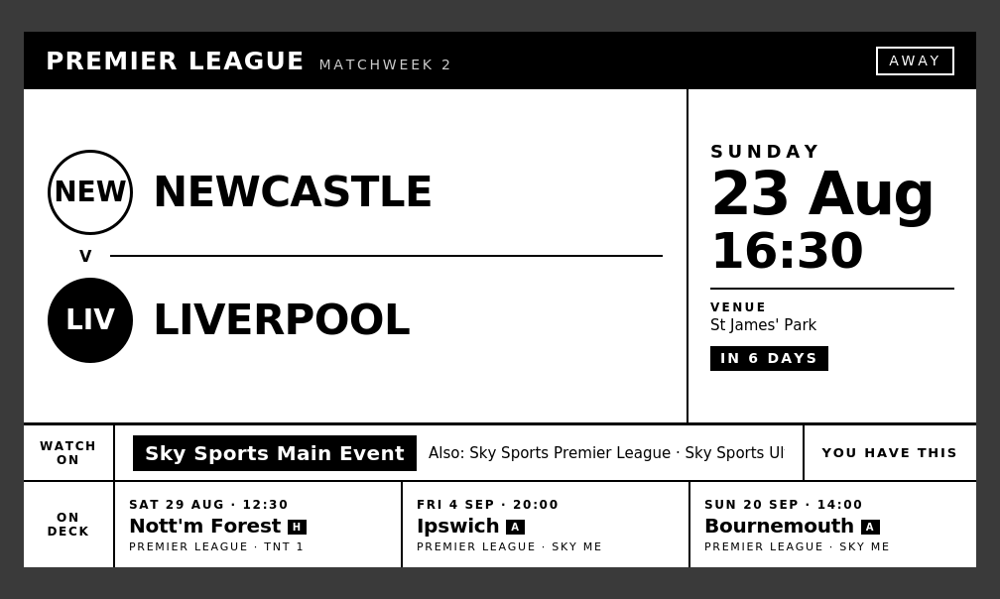

# trmnl-football-fixtures

Next fixture for your club — every competition, one glance — on a TRMNL
(LaraPaper BYOS) e-ink display, with the UK TV channel it's on and whether
that channel is in the subscriptions you actually hold.



## Architecture

A small Flask sidecar (`trmnl-football-api`, port 3458) polls
[API-Football](https://www.api-football.com/) (~8 calls/day, well inside the
100/day free tier) and optionally joins UK broadcast listings onto the
fixture list, serving a flat pre-formatted JSON payload that a LaraPaper
polling plugin renders every 15 minutes. Crests are composited, sharpened and
thresholded to 1-bit server-side for the e-ink panel.

The display refresh is fully decoupled from upstream polling: the device can
poll the sidecar every 15 minutes for free while upstream is hit once per
three hours, served stale (and flagged) on upstream failure.

## Broadcast data

**Disabled by default.** There is no free API for UK football broadcast
rights; when `ENABLE_BROADCAST=1` the sidecar fetches a public UK listings
page once per three hours, honours its `robots.txt`, sends an honest
User-Agent, and fails soft — a parse error degrades the channel band to
"to be confirmed" and never affects the fixture display. If you install this
from the catalog, please leave it off or use your own data source; a scraper
multiplied across many installs is not fair to a small independent site.

Five broadcast states: `available` (with owned/not-owned status against your
`OWNED_CHANNELS`), `unavailable`, `blackout` (Saturday 3pm closed period,
rendered as information, not an error), `tbc`, `none`.

## Deploy

```bash
cp .env.example .env      # add your API-Football key
docker compose --env-file .env up -d --build
curl http://<host>:3458/fixtures
```

Then create a LaraPaper polling plugin pointing at `/fixtures` with the
markup from `plugin/full.liquid` and `data_stale_minutes: 15`
(see `plugin/settings.yml`).

## Configuration

| Env | Default | |
|---|---|---|
| `API_FOOTBALL_KEY` | — | required |
| `TEAM_ID` | `40` | API-Football team id — verify via `/teams?search=` |
| `TEAM_NAME` | `Liverpool` | display name for the empty state |
| `OWNED_CHANNELS` | `sky,tnt,bbc,itv,channel4,channel5,s4c` | channel families you subscribe to |
| `ENABLE_BROADCAST` | `0` | UK channel band on/off |
| `PUBLIC_BASE_URL` | `http://192.168.68.111:3458` | absolute base for crest URLs |
| `CONTACT` | — | appended to the User-Agent when scraping |
| `FIXTURES_SOURCE` | `api` | `stub` serves saved test data (offline dev/demo) |

## Development

```bash
FIXTURES_SOURCE=stub python -m pytest tests/ -q      # all 5 states, offline
FIXTURES_SOURCE=stub python plugin/demo/render_demo.py  # demo HTML per state
```

Crests are trademarked assets: they are fetched and cached at runtime only
and never committed (`cache/` is gitignored).

## Known coverage limitation: domestic cups

`football-data.org`'s catalogue is thirteen league/international competitions
(`PL, ELC, CL, EC, WC, CLI` plus eight foreign leagues). **FA Cup and the
League/Carabao Cup are not in it at any tier**, so cup ties never arrive from
the fixtures API. Verify your own entitlement with:

```bash
curl -s -H "X-Auth-Token: $FOOTBALL_DATA_TOKEN" \
  https://api.football-data.org/v4/competitions | jq '[.competitions[].code]'
```

`app/cupfill.py` works around this by promoting orphan rows from the broadcast
listings (which do carry cup ties) into synthetic fixtures. It is additive:
an API fixture is never dropped or overridden, and dedupe is on match date.

**This recovers televised cup ties only.** An untelevised tie is still
invisible, because absence from the listings means "not on TV", never "no
fixture". A permanent fix needs a fixtures source that actually carries
domestic cups.

Controlled by `CUP_FILL_COMPS` (comma-separated competition names as they
appear on the listings page; empty string disables). Requires
`ENABLE_BROADCAST=1`. The payload reports how many fixtures were back-filled
at `sources.cup_fill`.
